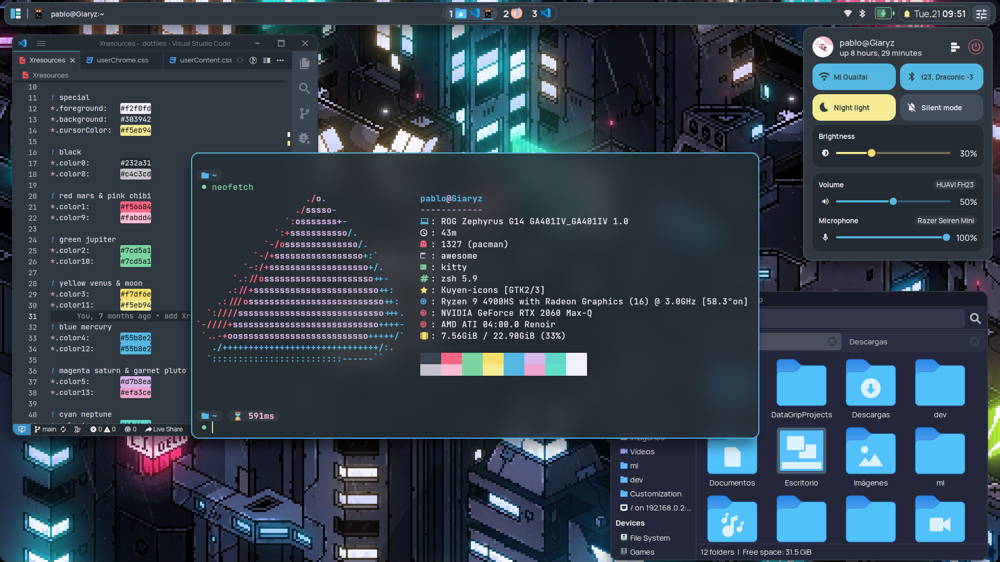
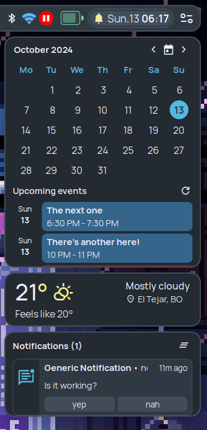
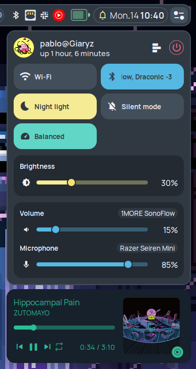
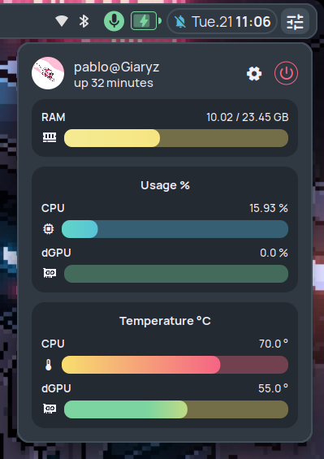
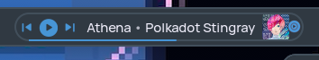
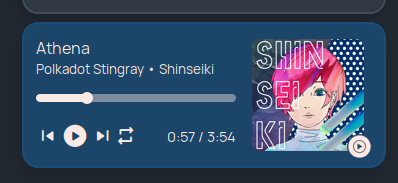
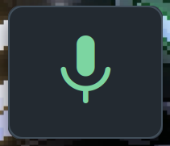
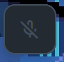
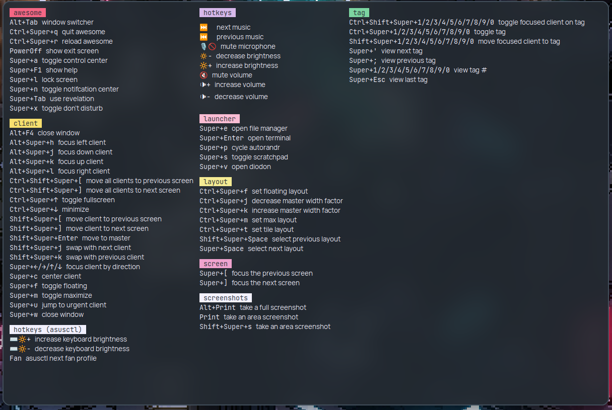

# awesomewm-configuration

[](https://github.com/zemmsoares/awesome-rices)
[](https://github.com/nikku/works-on-my-machine)

My personal AwesomeWM configuration for work and daily tasks 👨🏼‍💻



### ℹ️ Details

---

- 🐧 **OS:** EndeavourOS
- 🧑‍💻 **Terminal:** Kitty
- 🌙 **Icons:** [Küyen](https://github.com/fabianalexisinostroza/Kuyen-icons)
- 🔡 **Fonts**
  - Regular: [Manrope](https://www.gent.media/manrope)
  - Monospace: [JetBrains Mono Slashed](https://github.com/sharpjs/JetBrainsMonoSlashed#installation)
  - Icons: [Material Symbols Rounded](https://github.com/google/material-design-icons/tree/master/variablefont) and [jetbrains-mono-nerd](https://archlinux.org/packages/community/any/ttf-jetbrains-mono-nerd/)
- ▶ Video wallpaper [here](https://moewalls.com/pixel-art/cyberpunk-city-pixel-live-wallpaper/)
- 📄 Rest of .dotfiles [here](https://github.com/pablonoya/dotfiles)

### ✨ Features

---

- 🎨 Custom color scheme taken from [Xresources](https://github.com/pablonoya/dotfiles/blob/main/Xresources), available as vscode theme [here](https://github.com/pablonoya/seramuriana).
- 💻🖥 Multiple screen support (vertical screen in progress).
- 🎬 Simple animations with [Rubato](https://github.com/andOrlando/rubato) and this [picom fork](https://github.com/fdev31/picom).

#### Optional features

- ⏯ Auto-pausing video wallpaper.
- 🎶 Media controls with dominant colors.
- 📅 Google Calendar events.

### ⚙ Installation

---

Tested on Asus G14 (2020) with EndeavourOS

Install dependencies

```sh
pikaur -S awesome-git \
acpi acpid acpi_call upower \
pipewire pipewire-alsa pipewire-pulse playerctl pamixer jq \
brightnessctl networkmanager  \

# autostarted
polkit-gnome blueman network-manager-applet redshift-minimal \
picom-simpleanims-git diodon fusuma ulauncher \

# extra packages
lxappearance-gtk3 qt5ct-kde \
flameshot pavucontrol asusctl rog-control-center \

# for optional features
mpv xwinwrap-git \
python-pipx \
gcalendar \

--needed
```

Clone the proyect

```sh
git clone --recurse-submodules https://github.com/pablonoya/awesomewm-configuration
```

To obtain the color theme, copy or replace my [Xresources file](https://github.com/pablonoya/dotfiles/blob/main/Xresources) to

```sh
$HOME/.Xresources
```

Move the configuration folder to awesome directory

```sh
mv awesomewm-configuration $HOME/.config/awesome
```

Set your latitude and longitude in `theme/theme.lua` for redshift and optional weather widget.

```lua
theme.latitude = 12.345
theme.longitude = -67.890
```

<details>
<summary><b>Activate the optional features</b></summary>

#### Auto pausing Video wallpaper

Set Video paths in `theme/theme.lua`, vertical video is optional and it's used on vertical screens.

```lua
-- Video wallpaper
theme.videowallpaper_path = HOME .. "/videos/cyberpunk-city-pixel.mp4"
theme.videowallpaper_vertical_path = HOME .. "/videos/cyberpunk-city-pixel-vertical.mp4"
```

#### Media controls with dominant colors

Install my [dominantcolors script](https://github.com/pablonoya/dominantcolors) with pipx.

```
pipx install git+https://github.com/pablonoya/dominantcolors.git
```

Set the script path.

```lua
-- Dominantcolors script path
theme.dominantcolors_path = HOME .. "/.local/bin/dominantcolors"
```

#### Google Calendar events

Set gcalendar command with your account and output as json.

```lua
-- gcalendar command
theme.gcalendar_command = "gcalendar --account personal --output json"
```

#### Weather

Set your [OpenWeather](https://openweathermap.org/) API key.

```lua
-- OpenWeather api key
theme.weather_api_key = "yourapikeyhere"
```

</details>

### 🖼 Gallery

---

#### Information Docks: Calendar + Google calendar events, Weather and Notification Center



#### Control center

|                               Controls                                |                               Monitors                                |
| :-------------------------------------------------------------------: | :-------------------------------------------------------------------: |
|  |  |

#### Media controls with dominant colors in top bar and control center





#### Combined taglist + tasklist


With [Bling](https://github.com/BlingCorp/bling) previews!
|Tag preview|Client preview|
|:-:|:-:|
|| |

#### Lockscreen with word clock colorized by time of day

| Dawn                                                                                                            | Midday                                                                                                          | Night                                                                                                           |
| --------------------------------------------------------------------------------------------------------------- | --------------------------------------------------------------------------------------------------------------- | --------------------------------------------------------------------------------------------------------------- |
|  |  |  |

#### Some popups

| Volume                                                                                                                 | Layout                                                                                                                 |
| ---------------------------------------------------------------------------------------------------------------------- | ---------------------------------------------------------------------------------------------------------------------- |
|  |  |

| Mic on                              | Mic off                               |
| ----------------------------------- | ------------------------------------- |
|  |  |

#### Keyboard shortcuts



#### Exit screen


### 🤍 Acknowledgments

---

- [rxyhn](https://github.com/rxyhn)
- [Crylia](https://github.com/Crylia)
- [Kasper24](https://github.com/Kasper24)
- [elenapan](https://github.com/elenapan)
